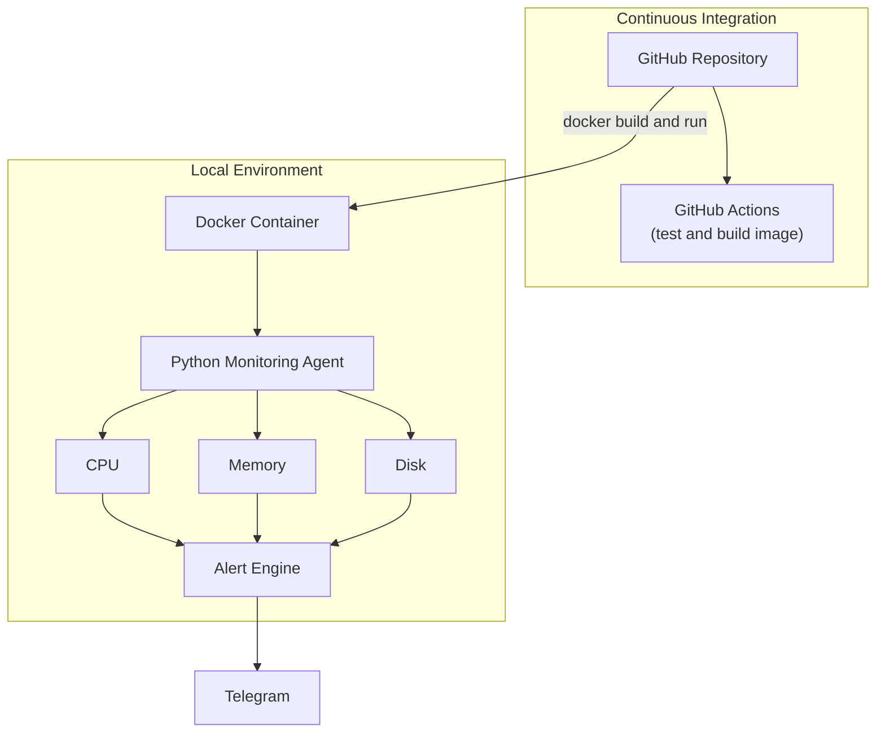

# Architecture v1 (MVP 1)

**Focus:** Monitoring, Docker, CI (Continuous Integration)

## Overview

MVP 1 delivers the core of the platform: a Python agent that collects CPU, memory, and disk metrics and sends alerts to Telegram when thresholds are exceeded. The agent is packaged as a Docker container and run locally. GitHub Actions provides Continuous Integration by running tests and building the Docker image on every change.

Deployment to the cloud is intentionally out of scope for this version
(see [Architecture v3](system-architecture-v3.md)).

## Diagram

## Components

| Component | Role | Related ADR |
|---|---|---|
| GitHub Repository | Source code hosting | - |
| GitHub Actions | Runs tests and builds the Docker image (CI only) | [ADR-003](003-use-github-actions.md) |
| Docker Container | Packages the agent and its dependencies | [ADR-002](002-use-docker.md) |
| Python Monitoring Agent | Collects system metrics using `psutil` | [ADR-001](001-use-python.md) |
| Alert Engine | Evaluates metrics against thresholds | - |
| Telegram | Notification channel | - |

## Data Flow

1. A code change is pushed to the GitHub repository.
2. GitHub Actions runs tests and builds the Docker image to verify it.
3. Locally, the image is built and run as a Docker container.
4. The Python agent collects CPU, memory, and disk metrics.
5. The alert engine evaluates the metrics against defined thresholds.
6. When a threshold is exceeded, a notification is sent to Telegram.

## Scope

In scope:
- CPU, memory, and disk monitoring
- Threshold-based alerting to Telegram
- Dockerized application
- CI with GitHub Actions (test and build)

Out of scope (planned for later MVPs):
- Log parsing, persistence, and alert cooldown ([v2](system-architecture-v2.md))
- Image publishing and automated deployment ([v3](system-architecture-v3.md))

