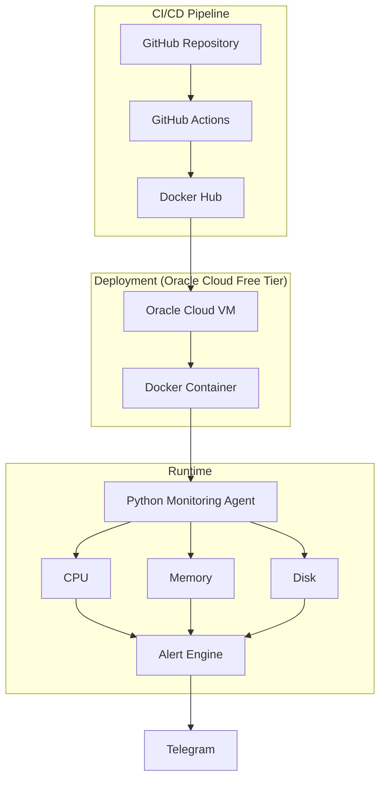

# Architecture v1 (MVP 1)

## Overview

This document describes the architecture of the monitoring platform for MVP 1. The system collects CPU, memory, and disk metrics on a cloud VM and sends alerts to Telegram when thresholds are exceeded. The application is built, packaged, and deployed through an automated pipeline.

## Diagram

## Components

| Component | Role | Related ADR |
|---|---|---|
| GitHub Repository | Source code hosting | - |
| GitHub Actions | Automated testing and image build | [ADR-003](003-use-github-actions.md) |
| Docker Hub | Container image registry | [ADR-002](002-use-docker.md) |
| Oracle Cloud VM | Public server for deployment | [ADR-004](004-use-oracle-cloud.md) |
| Docker Container | Packages the application and its dependencies | [ADR-002](002-use-docker.md) |
| Python Monitoring Agent | Collects system metrics using `psutil` | [ADR-001](001-use-python.md) |
| Alert Engine | Evaluates metrics against thresholds | - |
| Telegram | Notification channel | - |

## Data Flow

1. A code change is pushed to the GitHub repository.
2. GitHub Actions runs tests and builds the Docker image.
3. The image is pushed to Docker Hub.
4. The Oracle Cloud VM pulls the image and runs it as a Docker container.
5. The Python monitoring agent collects CPU, memory, and disk metrics.
6. The alert engine evaluates the metrics against defined thresholds.
7. When a threshold is exceeded, a notification is sent to Telegram.

## Scope

In scope for v1:
- CPU, memory, and disk monitoring
- Threshold-based alerting to Telegram
- Automated build and deployment pipeline

Planned for later MVPs: to be defined in Architecture v2 and v3.

