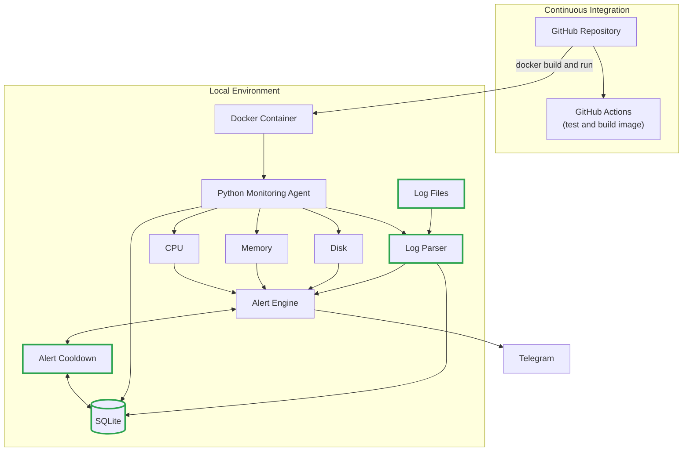

# Architecture v2 (MVP 2)

**Status:** Draft

**Focus:** Log parsing, SQLite, Alert Cooldown

## Overview

MVP 2 makes the platform smarter and less noisy. The agent gains the ability to parse log files, stores data in a local SQLite database, and applies a cooldown to alerts so the same issue does not trigger repeated Telegram notifications.

Everything from [Architecture v1](architecture-v1.md) remains in place.
Components new in this version are highlighted in the diagram.

## Diagram

## What Changed from v1

| Component | Change | Purpose |
|---|---|---|
| Log Parser | New | Reads log files and extracts events (e.g., errors) |
| Log Files | New | Source of log data for the parser |
| SQLite | New | Persists metrics history, log events, and alert state |
| Alert Cooldown | New | Suppresses repeated alerts for the same issue within a set period |
| Alert Engine | Updated | Now evaluates log events and checks cooldown before sending |

## Data Flow

1. The Python agent collects CPU, memory, and disk metrics.
2. The log parser reads log files and extracts relevant events.
3. Metrics and log events are stored in SQLite.
4. The alert engine evaluates metrics and log events against thresholds.
5. Before sending, the alert engine checks the cooldown state in SQLite.
6. If the cooldown has expired, the alert is sent to Telegram and the cooldown timestamp is updated.

## Design Notes

- SQLite data must live on a Docker volume so it survives container restarts.
- Cooldown state is stored in SQLite rather than in memory, so it also survives restarts.
- Retention of stored metrics (e.g., delete data older than N days) is an open question to decide during implementation.

## Scope

In scope:
- Log file parsing
- SQLite persistence
- Alert cooldown

Out of scope (planned for v3):
- Image publishing and automated deployment ([v3](system-architecture-v3.md))

