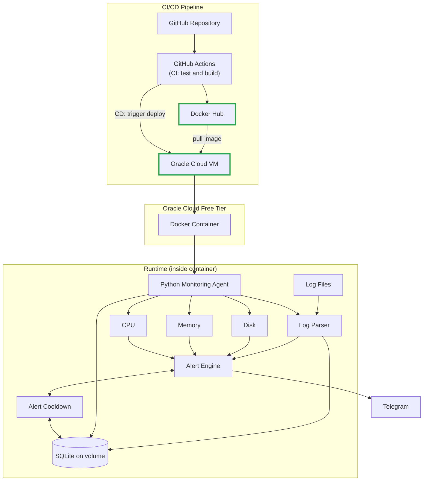

# Architecture v3 (MVP 3)

**Status:** Draft

**Focus:** GitHub Actions (CD), Docker Hub, Auto Deployment to Oracle Cloud

## Overview

MVP 3 completes the delivery pipeline. GitHub Actions is extended from CI to CD: after tests pass, the Docker image is pushed to Docker Hub and automatically deployed to an Oracle Cloud VM. The application itself (monitoring, log parsing, SQLite, alert cooldown) is unchanged from [Architecture v2](system-architecture-v2.md) but now runs on the cloud instead of locally.

## Diagram

## What Changed from v2

| Component | Change | Purpose |
|---|---|---|
| GitHub Actions | Extended | Adds CD: pushes the image and triggers deployment |
| Docker Hub | New | Registry that stores versioned container images |
| Oracle Cloud VM | New | Public server that runs the container 24/7 |
| Auto Deployment | New | New commits on the main branch reach the VM without manual steps |
| Runtime components | Unchanged | Same agent, parser, alert engine, and SQLite as v2 |

## Components

| Component | Role | Related ADR |
|---|---|---|
| GitHub Actions | CI and CD pipeline | [ADR-003](003-use-github-actions.md) |
| Docker Hub | Container image registry | [ADR-002](002-use-docker.md) |
| Oracle Cloud VM | Hosting for the container | [ADR-004](004-use-oracle-cloud.md) |
| Docker Container | Packages the application | [ADR-002](002-use-docker.md) |
| Python Monitoring Agent | Metrics collection and log parsing | [ADR-001](001-use-python.md) |

## Data Flow

1. A change is merged into the main branch.
2. GitHub Actions runs tests and builds the Docker image (CI).
3. On success, the image is pushed to Docker Hub with a version tag.
4. GitHub Actions triggers a deployment to the Oracle Cloud VM (CD).
5. The VM pulls the new image and restarts the container.
6. The agent resumes monitoring, with SQLite data preserved on a volume.

## Design Notes and Open Questions

- **Deployment mechanism:** the diagram shows a generic "trigger deploy". A common option is GitHub Actions connecting to the VM over SSH to run `docker pull` and `docker compose up -d`. This should be recorded as its own ADR when decided.
- **Secrets:** Docker Hub credentials, SSH key, and the Telegram bot token should be stored as GitHub Actions secrets, never in the repository.
- **Image tagging:** decide between commit SHA tags, semantic versions, or both, to make rollbacks possible.
- **Free tier limits:** the VM has constrained resources (see [ADR-004](004-use-oracle-cloud.md)), so the image should stay small.

## Scope

In scope:
- Push images to Docker Hub
- Automated deployment to Oracle Cloud
- Running the full monitoring stack on the cloud VM

Out of scope:
- To be defined after MVP 3

